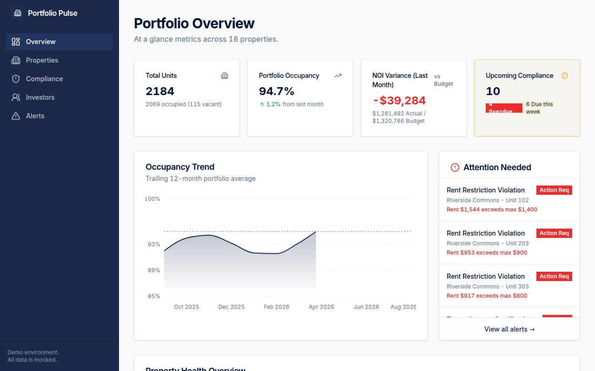
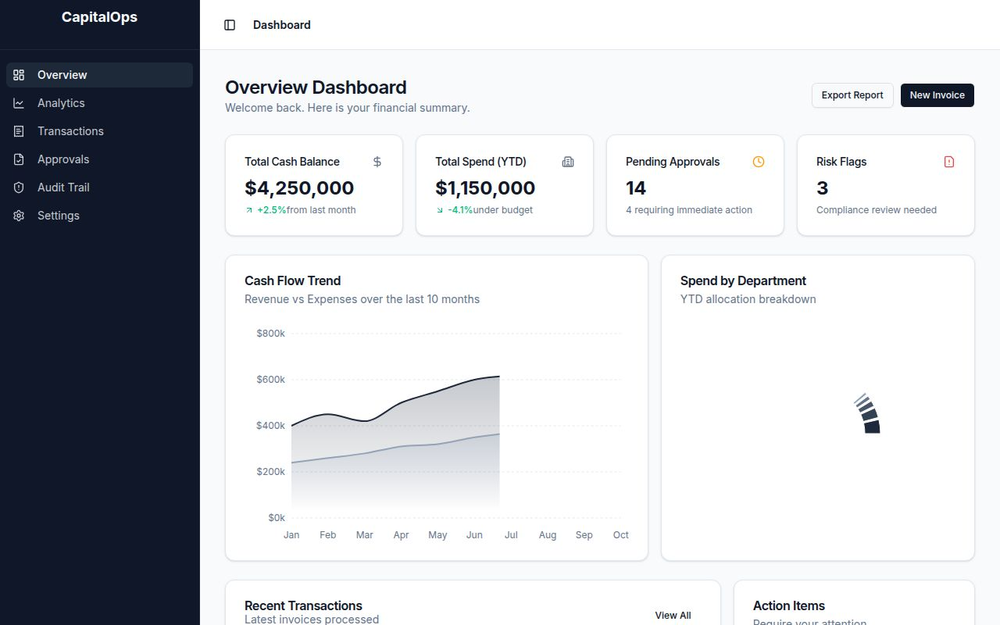
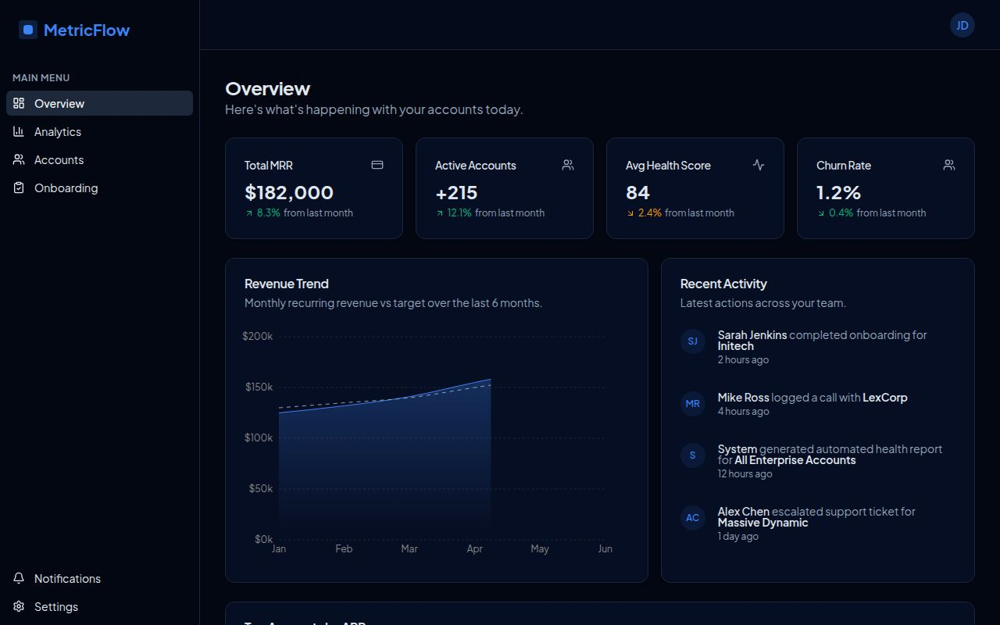

# React Dashboard Portfolio

Three production-quality dashboard applications built to demonstrate real-world React development skills across different industries. All dashboards feature comprehensive realistic mock data and are fully interactive.

**Built with:** React · TypeScript · Tailwind CSS · shadcn/ui · Recharts · Wouter · Vite · pnpm Workspaces

---

## Portfolio Pulse — Affordable Housing Asset Management

> A compliance and financial management dashboard for LIHTC (Low-Income Housing Tax Credit) and HUD-regulated affordable housing portfolios.



Designed for institutional asset managers overseeing 15–25 affordable housing properties. Answers three questions at a glance: Is the portfolio financially healthy? Is it in compliance? What needs attention this week?

**Key features:**
- Portfolio overview with 12-month occupancy trend and budget vs. actual NOI charts
- Compliance Tracker with overdue / due-this-week / upcoming grouping — modeled after how TIC recertifications and REAC inspections are actually tracked in the field
- Rent Roll with live rent-restriction violation flagging: units where current rent exceeds the AMI-restricted maximum are surfaced immediately
- Investor Reporting with **PDF export** — generates a formatted compliance and financial summary per investor/funder
- Alerts widget surfaces rent violations, overdue compliance events, and properties with negative NOI variance

**Domain logic:** AMI rent restriction enforcement, LIHTC compliance period tracking, HUD/LIHTC/HOME/State Trust Fund funding source classification, TIC recertification workflows

**Live demo:** *(add published URL)*

---

## CapitalOps — Finance Operations Dashboard

> Spend analytics, transaction management, invoice approvals, and vendor onboarding for a finance operations team.



**Key features:**
- Cash flow trend charts and YTD spend analytics by department and category
- Transaction table with status badges, search/filter, and a detail view with full approval history timeline
- Invoice approval queue with multi-step approval workflow
- 5-step vendor onboarding workflow with compliance fields, spend controls, and a review screen
- Audit trail with chronological activity logs and Settings

**Live demo:** *(add published URL)*

---

## MetricFlow — SaaS Operations Dashboard

> Customer analytics, account management, and onboarding automation for a SaaS company.



**Key features:**
- MRR, churn rate, active accounts, and revenue trend charts with month-over-month indicators
- Cohort retention analysis and funnel conversion charts
- Account list with health scores, status badges, and search/filter
- Account detail view with usage charts, activity timeline, and contact management
- 5-step customer onboarding wizard with per-step validation, back/next navigation, and a review screen
- Notifications feed and Settings

**Live demo:** *(add published URL)*

---

## Tech Stack

| Layer | Technology |
|---|---|
| Framework | React 18 + TypeScript |
| Build tool | Vite |
| Styling | Tailwind CSS v4 |
| Components | shadcn/ui + Radix UI |
| Charts | Recharts |
| Routing | Wouter |
| State | TanStack React Query |
| Monorepo | pnpm workspaces |

---

## Project Structure

```
artifacts/
├── portfolio-pulse/     # Affordable housing asset management dashboard
├── capitalops/          # Finance operations dashboard
└── metricflow/          # SaaS operations dashboard
lib/
├── api-client-react/    # Generated React Query hooks
├── api-spec/            # OpenAPI specification
└── db/                  # Drizzle ORM schema
screenshots/
├── portfolio-pulse.jpg
├── capitalops.jpg
└── metricflow.jpg
```

---

## Running Locally

Requires Node.js 20+ and pnpm.

```bash
# Install dependencies
pnpm install

# Run individual dashboards
pnpm --filter @workspace/portfolio-pulse run dev
pnpm --filter @workspace/capitalops run dev
pnpm --filter @workspace/metricflow run dev
```
