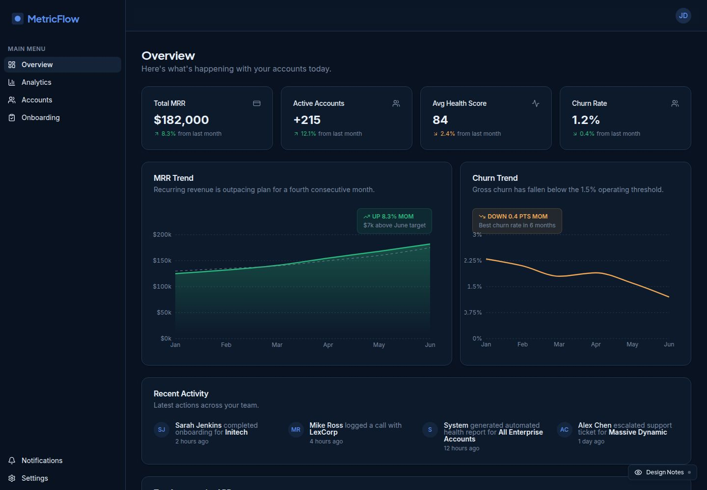
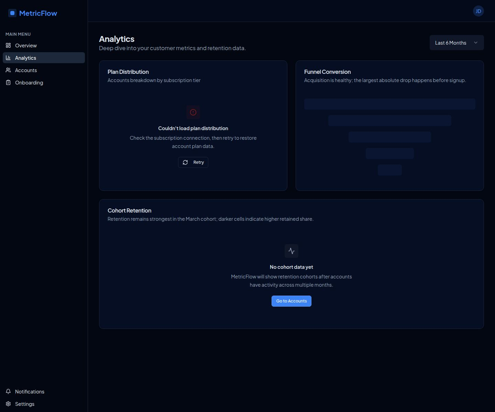

# React Dashboard Portfolio

Three polished React dashboard applications built as portfolio case studies across SaaS operations, finance operations, and affordable housing asset management. Each app uses realistic mock data and interactive UI patterns to demonstrate product thinking—not just visual styling.

**Built with:** React · TypeScript · Tailwind CSS · shadcn/ui · Radix UI · Recharts · Framer Motion · Wouter · Vite · pnpm Workspaces

---

## Portfolio Pulse — Affordable Housing Asset Management

> A compliance and financial management dashboard for LIHTC (Low-Income Housing Tax Credit) and HUD-regulated affordable housing portfolios.


Designed for institutional asset managers overseeing 15–25 affordable housing properties. Answers three questions at a glance: Is the portfolio financially healthy? Is it in compliance? What needs attention this week?

**Key features:**
- Portfolio overview with 12-month occupancy trend and budget vs. actual NOI charts
- Compliance Tracker with overdue / due-this-week / upcoming grouping — modeled after how TIC recertifications and REAC inspections are actually tracked in the field
- Rent Roll with live rent-restriction violation flagging: units where current rent exceeds the AMI-restricted maximum are surfaced immediately
- Investor Reporting with **PDF export** — generates a formatted compliance and financial summary per investor/funder
- Alerts widget surfaces rent violations, overdue compliance events, and properties with negative NOI variance

**Domain logic:** AMI rent restriction enforcement, LIHTC compliance period tracking, HUD/LIHTC/HOME/State Trust Fund funding source classification, TIC recertification workflows

**Live demo:** *(add published URL)*

---

## CapitalOps — Finance Operations Dashboard

> Spend analytics, transaction management, invoice approvals, and vendor onboarding for a finance operations team.


**Key features:**
- Cash flow trend charts and YTD spend analytics by department and category
- Transaction table with status badges, search/filter, and a detail view with full approval history timeline
- Invoice approval queue with multi-step approval workflow
- 5-step vendor onboarding workflow with compliance fields, spend controls, and a review screen
- Audit trail with chronological activity logs and Settings

**Live demo:** *(add published URL)*

---

## MetricFlow — SaaS Operations Dashboard

> Customer analytics, account management, and onboarding automation for a SaaS company.



MetricFlow is designed for a CS manager who needs to answer “is this account okay?” in seconds and then move directly into the right follow-up.

**Product features:**
- MRR, churn rate, active accounts, and revenue trend charts with month-over-month indicators
- Cohort retention analysis and funnel conversion charts
- Account list with health scores, status badges, and search/filter
- Account detail view with usage charts, activity timeline, and contact management
- 5-step customer onboarding wizard with per-step validation, back/next navigation, and a review screen
- Notifications feed and Settings
- Intentional loading skeletons, empty states, and recovery states across every data-driven view

**Design work:**
- Approved dark instrument-panel design system with Signal Blue actions, functional health colors, Plus Jakarta Sans display type, and Inter data type
- Chart redesigns that surface decision context directly in MRR, churn, funnel, and retention views
- Restrained dashboard entrance motion, hover feedback, directional wizard transitions, and reduced-motion support
- Toggleable **Design Notes** mode: six first-person rationale popovers explain the UX decisions behind the dashboard, charts, account health scan, and onboarding flow

### MetricFlow design walkthrough

The default product stays clean for everyday use. Turn on **Design Notes** from the floating control in the lower-right corner to reveal the thinking behind six key design decisions—built for recruiters and clients evaluating redesign work.

| Default product experience | Data-state and interaction examples |
|---|---|
|  |  |

**Live demo:** *(add published URL)*

---

## Tech Stack

| Layer | Technology |
|---|---|
| Framework | React 18 + TypeScript |
| Build tool | Vite |
| Styling | Tailwind CSS v4 |
| Components | shadcn/ui + Radix UI |
| Charts | Recharts |
| Motion | Framer Motion with reduced-motion support |
| Routing | Wouter |
| State | TanStack React Query |
| Monorepo | pnpm workspaces |

---

## Project Structure

```
artifacts/
├── portfolio-pulse/     # Affordable housing asset management dashboard
├── capitalops/          # Finance operations dashboard
└── metricflow/          # SaaS operations dashboard
lib/
├── api-client-react/    # Generated React Query hooks
├── api-spec/            # OpenAPI specification
└── db/                  # Drizzle ORM schema
screenshots/
├── portfolio-pulse.jpg
├── capitalops.jpg
├── metricflow-design-notes-off.jpg
├── metricflow-data-state-matrix.jpg
├── metricflow-token-system-dashboard.jpg
├── metricflow-token-system-mobile-accounts.jpg
└── metricflow-motion-polish.jpg
```

---

## Running Locally

Requires Node.js 20+ and pnpm.

```bash
# Install dependencies
pnpm install

# Run individual dashboards
pnpm --filter @workspace/portfolio-pulse run dev
pnpm --filter @workspace/capitalops run dev
pnpm --filter @workspace/metricflow run dev
```
