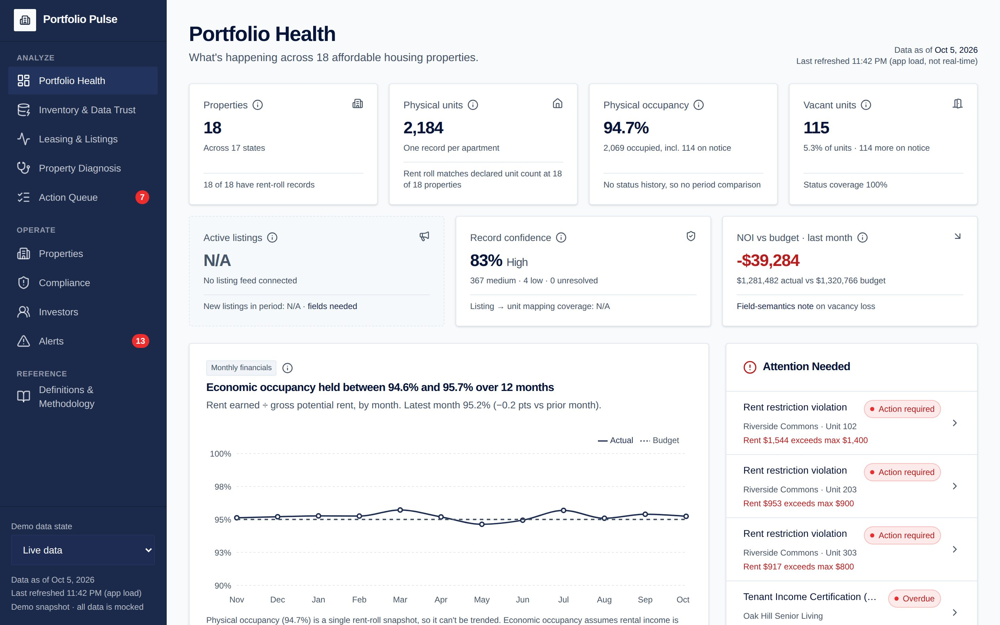
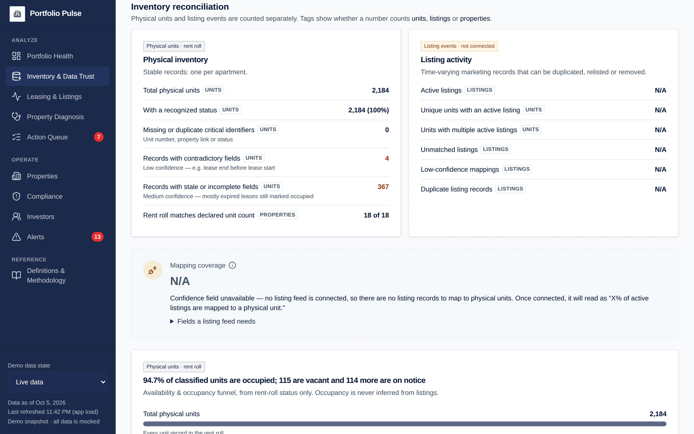
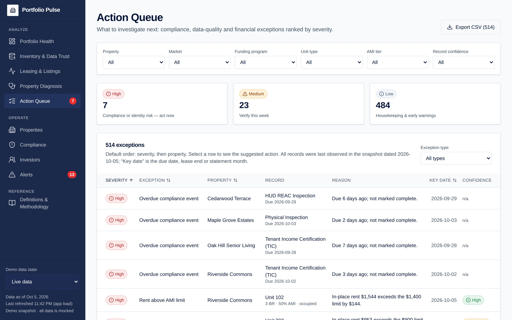
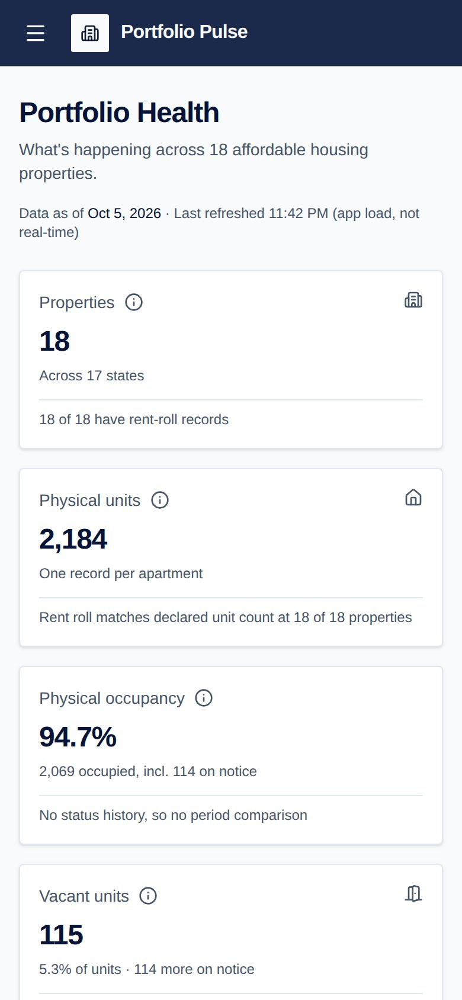
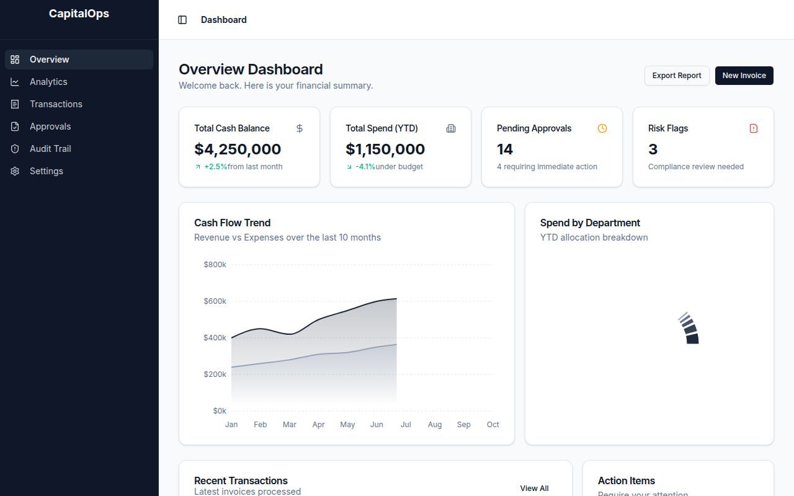
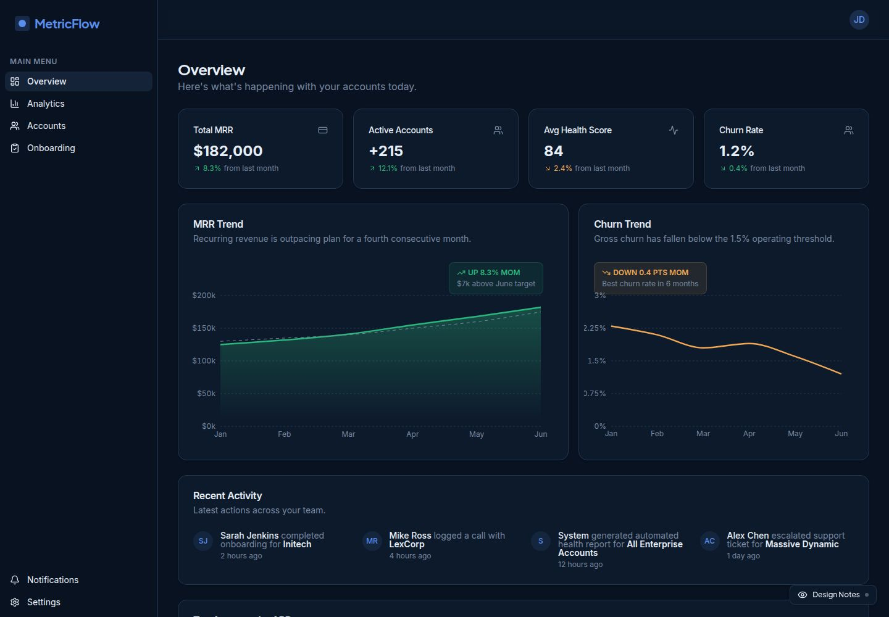
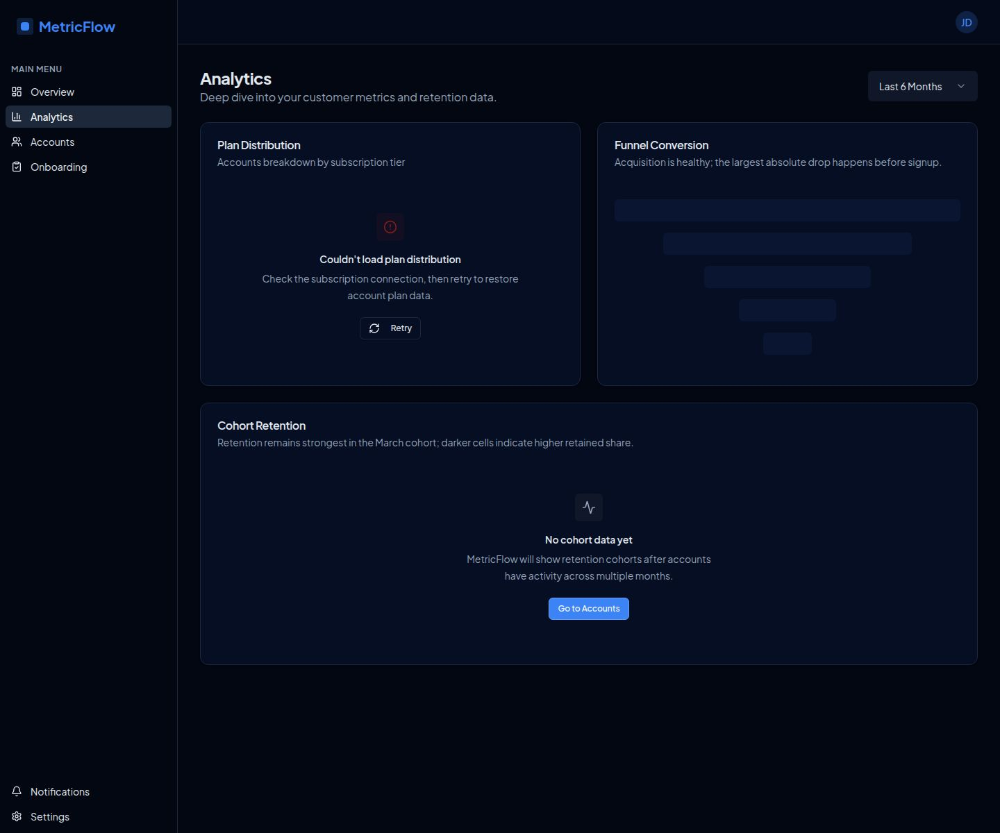

# React Dashboard Portfolio

Three polished React dashboard applications built as portfolio case studies across SaaS operations, finance operations, and affordable housing asset management. Each app uses realistic mock data and interactive UI patterns to demonstrate product thinking—not just visual styling.

**Built with:** React · TypeScript · Tailwind CSS · shadcn/ui · Radix UI · Recharts · Framer Motion · Wouter · Vite · pnpm Workspaces

---

## Portfolio Pulse — Affordable Housing Asset Management

> A decision-oriented data product for LIHTC and HUD-regulated affordable housing portfolios: portfolio health → property diagnosis → action queue, with data trust made visible at every step.



| Inventory & Data Trust | Action Queue | Mobile (390px) |
|---|---|---|
|  |  |  |

**At a glance:** 18 LIHTC / HUD properties · 2,184 units · 94.7% physical occupancy · 3 AMI rent-limit violations · 4 overdue compliance events · 6 investor reporting relationships · 514 prioritized exceptions.

### Affordable housing domain

The original affordable-housing asset-management tools are all still here; the analytics layer is built on top of them.

- **AMI rent restrictions:** every unit carries an AMI tier (30 / 40 / 50 / 60%) and a maximum allowable rent. Units charging above the limit are flagged as rent-restriction violations (3 in the portfolio, all at Riverside Commons) — reportable LIHTC noncompliance.
- **Set-asides and funding layers:** properties carry their AMI set-asides and funding sources (9% LIHTC, 4% LIHTC + tax-exempt bonds, HOME, HUD Section 8, State Trust Fund). Units whose AMI tier isn't one of the property's set-asides are flagged.
- **Compliance calendar:** tenant income certifications and annual recertifications, HUD REAC and physical inspections, state agency monitoring, owner certifications and utility-allowance updates, grouped as overdue / due this week / upcoming.
- **Compliance period tracking:** properties past the 15-year federal compliance period are flagged to confirm extended-use monitoring and investor exit plans (3 properties).
- **Investor reporting:** reporting schedules for LIHTC syndicators, lenders, HUD and the state housing finance agency, with a one-page **PDF investor report** per relationship.
- **Financial performance:** NOI vs budget by property, line-item variance, physical vs economic occupancy, and in-place rent vs AMI limit (rent-to-limit).

Rent limits in the demo data are illustrative, not actual HUD-published limits for a specific county.

### Why this dashboard exists

Portfolio Pulse helps affordable multifamily operators move from high-level portfolio metrics to the records that explain them. It separates stable physical-unit inventory from changing listing activity, surfaces data coverage and uncertainty, and prioritizes exceptions that require operational or data-quality follow-up.

It answers three increasingly specific questions:

1. **Portfolio health** — what's happening across the portfolio? *(Portfolio Health)*
2. **Property diagnosis** — which properties, markets and unit types explain it? *(Inventory & Data Trust, Leasing & Listings, Property Diagnosis)*
3. **Action queue** — what should an operator, asset manager or data team investigate next? *(Action Queue)*

**Pages**

| Page | What it does |
|---|---|
| Portfolio Health | 7 executive KPIs, each with definition, coverage context and N/A where unsupported; economic occupancy trend; guided next steps |
| Inventory & Data Trust | Units-vs-listings reconciliation, mapping coverage, occupancy funnel (with "Unable to classify"), rule-based record confidence tiers, reported-vs-rent-roll occupancy reconciliation, a field-semantics finding |
| Leasing & Listings | Lease starts with period-over-period comparison, lease expiration schedule, turnover by property and unit type; listing metrics shown as unavailable |
| Property Diagnosis | Sortable property table and unit-mix view, driven by shared filters (property, market, funding program, bedrooms, AMI tier, record confidence, 30/90/180/365-day window) |
| Action Queue | Exceptions from 23 evaluated rules (514 rows from 9 firing rules in the current snapshot), filter/sort/paginate, CSV export, a suggested action per row, and a list of checks that ran, passed, or couldn't run |
| Definitions & Methodology | Sources and refresh, concepts, metric formulas, thresholds, limitations, fields needed, design decisions |
| Properties, Compliance, Investors, Alerts | Existing operational views: rent roll with violation flags, compliance tracker, investor PDF reports |

### Key design decisions

- **Physical units and listings are modeled separately.** Units are stable inventory (one rent-roll record per apartment); listings are noisy marketing events that can be duplicated, relisted or left up after leasing. Active listings are never treated as vacant units.
- **Incomplete records are surfaced, not silently excluded.** Every rent-roll record runs 15 checks. Failing records keep counting where they're still valid, are tiered High / Medium / Low / Unresolved, and appear in the Action Queue with a plain-English reason.
- **Confidence and coverage travel with the metric.** KPIs carry coverage context; the Data Trust page quantifies how many records sit below High. Checks that can't run are listed as "not evaluated", so an empty queue isn't mistaken for clean data.
- **Unavailable means N/A, with the missing fields named.** The dataset has no listing feed. The listing model, metrics and exception rules are implemented and unit-tested against fixtures, but the app shows N/A until a real feed is connected.
- **Productionizing would need:** data contracts per source (types, null rules, freshness SLAs); source monitoring on row counts and check failures; incremental refreshes with daily snapshots (to trend occupancy and data quality); entity-resolution QA on a labeled sample for listing→unit matching; and role-based access so investor-facing views exclude resident PII.

### What the data supports — and what it doesn't

| Implemented from source data | Unavailable (shown as N/A) and why |
|---|---|
| Properties, physical units, physical occupancy, vacant and notice units (rent roll) | Active / new listings, delistings, days on market, advertised rent, mapping coverage, match confidence — no listing feed |
| Economic occupancy (financials; field meaning validated against rent-roll GPR) | Time to lease, vacant days — no `available_at` / `lease_signed_at` |
| Lease starts and expirations (current leases), rent-to-limit, in-place rent | Occupancy trend and period-over-period — unit status is a single snapshot |
| Record confidence tiers, reported-vs-rent-roll occupancy gaps, unit-count reconciliation | Bathrooms / floor plans, submarket, asset class — fields not in source |

**Findings the data-trust checks surfaced in the dataset:** 4 leases end before they start; 367 occupied units have an expired lease end date; 7 properties report occupancy more than 2 pts away from their rent roll; and rental income reconciles to gross potential rent *net* of vacancy for 100% of property-months, which means the existing NOI formula likely double-counts vacancy loss. The NOI calculation is left unchanged pending confirmation of the field's meaning.

**Also included:** fully responsive layouts from 390px to 1440px with 44px touch targets, one status color system with AA contrast, and loading / empty / error states on every data view (use **Demo data state** in the sidebar or `?state=loading|empty|error`).

**Code layout:** data transformations live in `artifacts/portfolio-pulse/src/lib/analytics/` (pure TypeScript, no React): `dates`, `normalize`, `dedupe`, `format`, `inventory`, `listings`, `leasing`, `exceptions`, `filters`, `diagnostics`, `definitions`, `model`. Tests are in `__tests__/` and run with `pnpm --filter @workspace/portfolio-pulse test`.

**Live demo:** *(add published URL)*

---

## CapitalOps — Finance Operations Dashboard

> Spend analytics, transaction management, invoice approvals, and vendor onboarding for a finance operations team.



**Key features:**
- Cash flow trend charts and YTD spend analytics by department and category
- Transaction table with status badges, search/filter, and a detail view with full approval history timeline
- Invoice approval queue with multi-step approval workflow
- 5-step vendor onboarding workflow with compliance fields, spend controls, and a review screen
- Audit trail with chronological activity logs and Settings

**Live demo:** *(add published URL)*

---

## MetricFlow — SaaS Operations Dashboard

> Customer analytics, account management, and onboarding automation for a SaaS company.



MetricFlow is designed for a CS manager who needs to answer “is this account okay?” in seconds and then move directly into the right follow-up.

**Product features:**
- MRR, churn rate, active accounts, and revenue trend charts with month-over-month indicators
- Cohort retention analysis and funnel conversion charts
- Account list with health scores, status badges, and search/filter
- Account detail view with usage charts, activity timeline, and contact management
- 5-step customer onboarding wizard with per-step validation, back/next navigation, and a review screen
- Notifications feed and Settings
- Intentional loading skeletons, empty states, and recovery states across every data-driven view

**Design work:**
- Approved dark instrument-panel design system with Signal Blue actions, functional health colors, Plus Jakarta Sans display type, and Inter data type
- Chart redesigns that surface decision context directly in MRR, churn, funnel, and retention views
- Restrained dashboard entrance motion, hover feedback, directional wizard transitions, and reduced-motion support
- Toggleable **Design Notes** mode: six first-person rationale popovers explain the UX decisions behind the dashboard, charts, account health scan, and onboarding flow

### MetricFlow design walkthrough

The default product stays clean for everyday use. Turn on **Design Notes** from the floating control in the lower-right corner to reveal the thinking behind six key design decisions—built for recruiters and clients evaluating redesign work.

| Default product experience | Data-state and interaction examples |
|---|---|
|  |  |

**Live demo:** *(add published URL)*

---

## Tech Stack

| Layer | Technology |
|---|---|
| Framework | React 18 + TypeScript |
| Build tool | Vite |
| Styling | Tailwind CSS v4 |
| Components | shadcn/ui + Radix UI |
| Charts | Recharts |
| Motion | Framer Motion with reduced-motion support |
| Routing | Wouter |
| State | TanStack React Query |
| Monorepo | pnpm workspaces |

---

## Project Structure

```
artifacts/
├── portfolio-pulse/     # Affordable housing asset management dashboard
├── capitalops/          # Finance operations dashboard
└── metricflow/          # SaaS operations dashboard
lib/
├── api-client-react/    # Generated React Query hooks
├── api-spec/            # OpenAPI specification
└── db/                  # Drizzle ORM schema
screenshots/
├── portfolio-pulse.jpg
├── portfolio-pulse-data-trust.jpg
├── portfolio-pulse-action-queue.jpg
├── portfolio-pulse-mobile.jpg
├── capitalops.jpg
├── metricflow-design-notes-off.jpg
├── metricflow-data-state-matrix.jpg
├── metricflow-token-system-dashboard.jpg
├── metricflow-token-system-mobile-accounts.jpg
└── metricflow-motion-polish.jpg
```

---

## Running Locally

Requires Node.js 20+ and pnpm.

```bash
# Install dependencies
pnpm install

# Run individual dashboards (Vite needs PORT and BASE_PATH)
PORT=5173 BASE_PATH=/ pnpm --filter @workspace/portfolio-pulse run dev
pnpm --filter @workspace/capitalops run dev
pnpm --filter @workspace/metricflow run dev

# Portfolio Pulse analytics tests and production build
pnpm --filter @workspace/portfolio-pulse test
PORT=5173 BASE_PATH=/ pnpm --filter @workspace/portfolio-pulse run build
```
